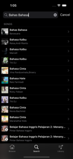

# iOS-Spotify-Clone-App
Spotify Clone iOS App with Swift.

# Specs
* iOS 14 and later
* MVVM
* Programmatically UI (UIKit)
* [SDWebImage](https://github.com/SDWebImage/SDWebImage)
* [Spotify Developer API](https://developer.spotify.com/documentation/web-api)

# Preview

\

\

